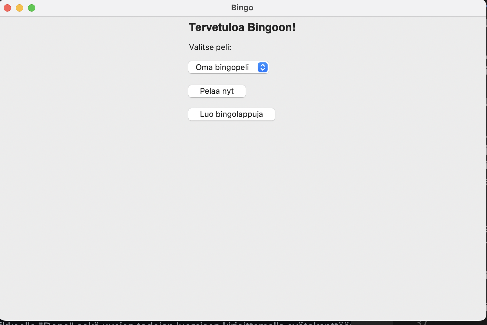
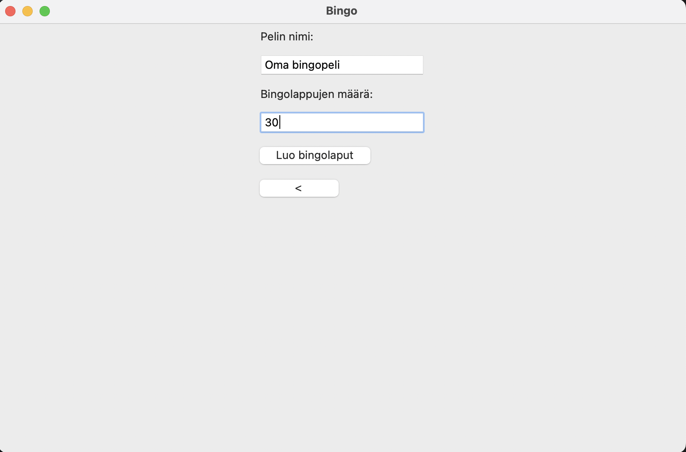
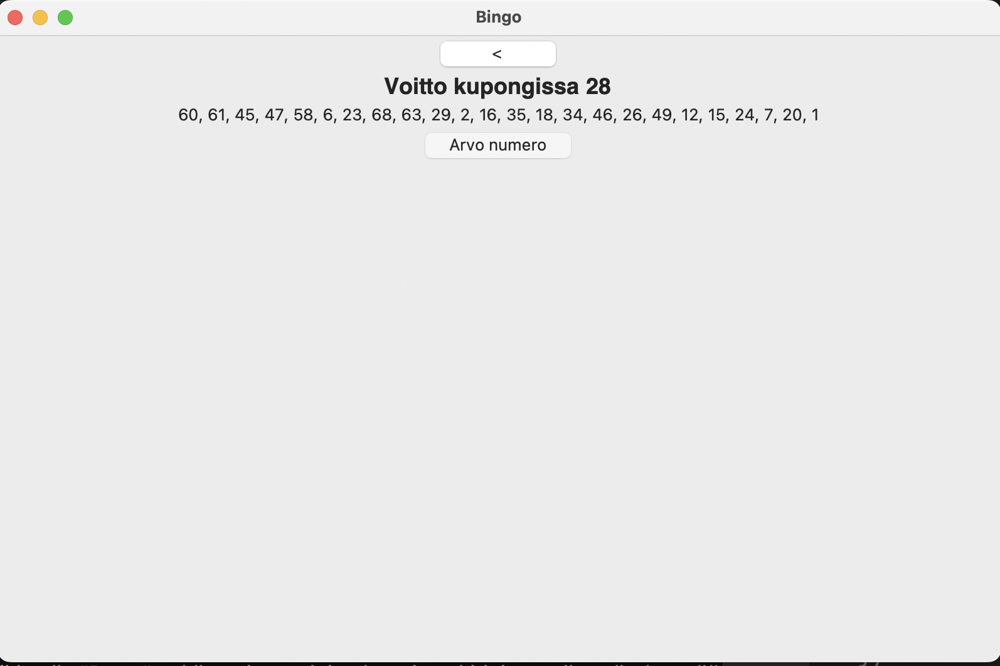

# Käyttöohje

Lataa viimeisimmän releasen lähdekoodi.

## Ohjelman asentaminen ja käynnistäminen

Asenna riippuvuudet ennen ohjelman käynnistämistä:

```bash
poetry install
```

Suorita alustustoimenpiteet:

```bash
poetry run invoke build
```

Käynnistä ohjelma:

```
poetry run invoke start
```

## Bingolappujen luominen

Sovellus käynnistyy aloitusnäkymään:




Siirry aloitusnäkymästä bingolappujen luonti-näkymään "Luo bingolappuja"-painikkeella.

Bingolappujen luontinäkymä:



Luo uusia bingolappuja syöttämällä haluamasi pelin nimi ja haluamasi bingolappujen määrä niille tarkoitettuihin kenttiin. Tämän jälkeen Bingolaput luodaan "Luo bingolaput"-painikkeella. 

Tämän jälkeen luodut bingolaput avautuvat järjestelmän oletus PDF-lukijalla, josta ne voi esimerkiksi tulostaa.

PDF-tiedosto tallentuu sovelluksen juurihakemistoon, josta sen voi myös myöhemmin avata. Se poistuu hakemistosta, kun uusia Bingolappuja luodaan.

## Bingon pelaaminen

Valitse haluamasi peli sovelluksen aloitusnäkymästä ja paina "Pelaa nyt"-painiketta.

Arvo bingonumerot painamalla "Arvo numero"-painiketta.
Kun bingokupongista löytyy voitto, siitä tulee ilmoitus ja peli päättyy:



