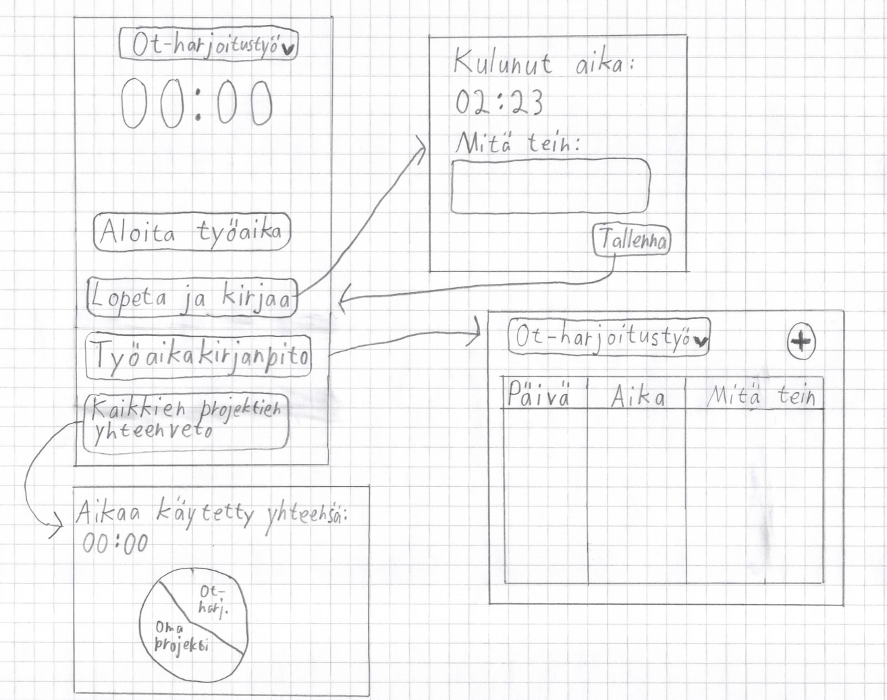

# Vaatimusmäärittely

## Sovelluksen tarkoitus
Käyttäjä voi käyttää sovellusta työtuntien kirjanpitoon.

## Käyttöliittymäsuunnitelma

Sovelluksessa on neljä eri näkymää

[Käyttöliittymäsuunnitelma](./kuvat/kayttoliittyma-suunnitelma.png)

## Perusversion tarjoama toiminnallisuus
- Käyttäjä voi aloittaa ja lopettaa työajan
- Työajan lopettamisen jälkeen sovellus laskee kuluneen ajan ja kysyy mitä työaikana on tehty
- Käyttäjä näkee käyttämänsä työtunnit ja selitykset.
- Käyttäjä voi luoda eri projekteihin erillisen työaikakirjanpidon
- Käyttäjä näkee ympyrädiagrammin eri projekteihin käyttämästään ajasta ja kaikkiin projekteihin käytetyn kokonaisajan

## Jatkokehitysideoita
- Työaikakirjanpidon vienti taulukkolaskentasovelukselle sopivaan tiedostoon
- Käyttäjä voi tallentaa työaikakirjanpidon tietokantatiedoston haluamaansa paikkaan ja tuoda tallennuten tiedoston sovellukseen graafisen käyttöliittymän kautta